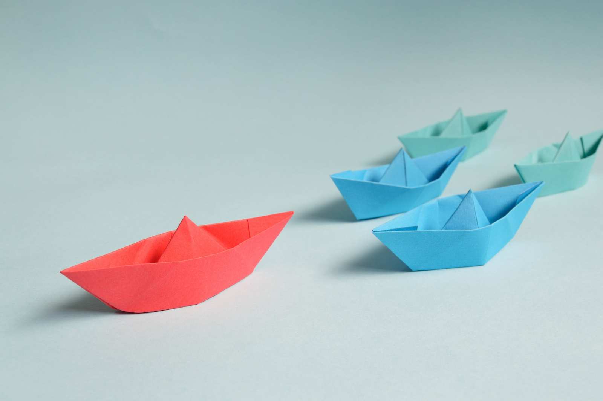
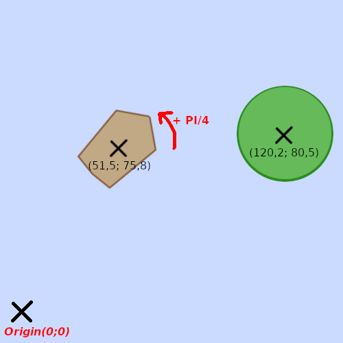

# Hissez haut !
Nous sommes en plein âge d'or de la piraterie.

De nombreux équipages se font la guerre pour savoir qui sont les plus grands pirates de nos mers et océans.
Après moultes disputes, les plus grands équipages pirates de ce monde ont décidé de s'affronter lors d'un grand tournoi de piraterie. A l'ordre du jour, frégates et batailles navales.

Vous et votre équipe incarnez un des équipages engagés dans le tournoi.
Vous êtes à la tête d’un navire qui doit être piloté avec précision afin d’être le premier à atteindre l’objectif de chaque partie.

Chaque navire dispose d’un équipage de marins qui doivent exécuter des actions sur les différents éléments du bateau afin de le piloter.

## Les modes de jeu
Les modes de jeux permettent aux équipes de s’affronter dans différentes épreuves et d’élaborer plusieurs stratégies.
### La frégate
Les équipes s’affrontent dans une course de vitesse.

Un bateau finit la partie lorsqu’il a franchi dans l'ordre le ou les points de passage de la frégate.

Chaque partie disposant d'un nombre limité de tours, les bateaux n'ayant pas franchit le dernier point de passage dans les temps perdent la partie.

### La bataille navale
Le but de ce mode de jeu est d’éliminer tous les autres navires et d’être le dernier bateau survivant.

Si plusieurs navires sont toujours à flot à la fin du dernier tour, ils seront classés en fonction du nombre de dommages total qu'ils auront causés (tir de canon ou collision).

## La mer
La mer désigne le monde dans lequel se passe le jeu et où les bateaux vont évoluer.

La mer contient de nombreux éléments qui sont positionnés selon des coordonnées orthonormées (Nord/Ouest) et orientés selon un angle calculé par rapport au Nord.
Chaque élément à une forme définie tel qu'un rectangle (défini par sa hauteur et sa largeur) ou un disque (défini par son rayon).


```
Dans cet exemple, un bateau rectangulaire est positionné en [51,5; 75,8] et son orientation est de PI/4. Il fait face à un recif circulaire positionné en [120,2; 80,5].
```
### Le vent
Le vent est un élément non positionné, il souffle de manière constante sur l'ensemble de la mer.

Son orientation et sa vitesse peuvent varier au cours d'une partie, elles sont donc communiquées au début de chaque tour.

### Les récifs
Les récifs constituent des obstacles à éviter pour les bateaux. Si un compétiteur rencontre un récif, son embarcation sera non seulement stoppée dans sa course mais recevra également des dommages proportionnels à sa vitesse et à l’angle de l’impact.

### Les courants
Les bateaux se trouvant sur un courant océanique profitent d’une augmentation de leur vitesse dans la direction du courant.

La puissance du courant est donnée lors du début du tour de jeu.

### Les navires
Un navire représente une équipe. La vie restante d’un vaisseau est communiquée, au début du tour de jeu, à tous les joueurs qui peuvent le voir.

Deux bateaux qui se percutent vont s'endommager l’un l’autre de manière égale. La valeur des dommages est proportionnelle à leur vitesse relative, dans la limite des points de vie restant au bateau le plus endommagé.

## Votre navire
Le navire désigne l’embarcation pilotée par une équipe.
Chaque équipe ne dispose que d'un seul navire.

### Pont du bateau et équipements
Votre bateau dispose d'un pont sur lequel sont disposés un ensemble d'équipements actionnables.

#### Le pont
Le pont de votre navire est représenté par une grille à deux dimensions (seconde carte, indépendante de la mer).
Les équipements disponibles sur un bateau sont positionnés sur une des cases de cette grille.

La taille de la grille, ainsi que les équipements présents (et leur position) sont donnés au début de la partie.

#### Les rames
Lorsqu'elles sont actionnées, les rames augmentent la vitesse du bateau. Plus le nombre de rames actives est important, plus l’augmentation de vitesse est importante.

Si plus de rames sont actionnées d’un côté du bateau que de l’autre, cela engendre une rotation de ce dernier.

#### Le gouvernail
Le gouvernail permet d'agir sur l’orientation du vaisseau.

#### Les mâts
Un mât et sa voile permettent d'agir sur la vitesse du bateau.
Une voile peux être hissée ou bien affalée.
Les parties commencent avec les voiles baissées.

Le voile levée permet d’agir sur la vitesse du bateau en fonction de l’angle relatif du vent dans la voile: le navire est accéléré s'il est dos au vent. Il est ralenti s'il fait face au vent.

#### La vigie
La vigie n’a pas d’effet sur les mouvements du bateau.

En revanche, si un marin est monté dans la vigie, le bateau gagne un bonus de vision. Grâce à ce dernier, lors du début de chaque tour, l’équipe obtient plus d’information sur les éléments positionnés dans la mer.

#### Les canons
Les canons permettent de tirer des projectiles sur les autres bateaux afin de leur infliger des dégâts.

Les actions effectuables sur un canon sont les suivantes : tirer, recharger, ou orienter le canon. Tirer ne peut s’effectuer que si le canon est chargé. Tirer et recharger ne peuvent pas s’effectuer durant le même tour de jeu. L'orientation du canon ne peut être faite que dans la limite d'angle donnée en début de partie.

Le tir s’effectue en ligne droite dans la direction du canon sur une distance communiquée en début de partie.

#### Exemples de bateaux


```
Une petite barque disposant de deux rames.
```


```
Un vaisseau tout équipé avec 3 mâts, une vigie, un gouvernail, 16 canons et 16 rames.
```

## Votre équipage
Chaque navire possède son équipage.

La taille de l'équipage peut varier d'une partie à une autre. En revanche, elle reste la même durant toute la durée de la partie.

Comme les équipements de votre bateau, les marins sont positionnés sur la grille représentant le pont du navire. Plusieurs marins peuvent être sur la même case. 

Chacun des marins qui constituent votre équipage peut à chaque tour de jeu :
 - se déplacer sur le pont du bateau, d'un maximum de 5 cases
 - effectuer une seule action sur un équipement présent sur sa case

**Les actions effectuables par les marins :**

| Action | Condition |
|--|--|
| Déplacer marin | Le marin ne s'est pas encore déplacé. La case visée existe. |
| Ramer | Le marin est inoccupé. Il est positionné sur la même case qu'une rame non utilisée. |
| Hisser la voile | Le marin est inoccupé. Il est positionné sur la même case qu'un mat non utilisé avec la voile basse.  |
| Affaler la voile | Le marin est inoccupé. Il est positionné sur la même case qu'un mat non utilisé avec la voile haute.  |
| Actionner le gouvernail | Le marin est inoccupé. Il est positionné sur la même case qu'un gouvernail non utilisé.  |
| Monter la garde | Le marin est inoccupé. Il est positionné sur la même case qu'une vigie non utilisée.  |
| Orienter le canon | Le marin est inoccupé. Il est positionné sur la même case qu'un canon.  |
| Charger le canon | Le marin est inoccupé. Il est positionné sur la même case qu'un canon non chargé.  |
| Tirer au canon | Le marin est inoccupé. Il est positionné sur la même case qu'un canon chargé.  |

## Déroulement du tournoi
Le grand tournoi de piraterie s'étale sur tout le semestre et se déroule en une succession d'épreuves.  
Une épreuve aura lieu chaque semaine.
Le mode de jeu de l'épreuve sera communiqué à l'avance afin que chaque équipe puisse s'y préparer.  
Chaque épreuve correspond à un livrable décrit dans [ce document](./DELIVERY_PROCESS.md).  

A chaque épreuve, entre 0 et 10 points seront donnés à chaque équipe en fonction de leur classement lors de la partie.
Le nombre total de points obtenus pendant le tournoi déterminera le classement final du tournoi.

## Déroulement d'une partie
### Initialisation de la partie
Toutes les équipes reçoivent des indications sur le mode de jeu de la partie et sa configuration.  
Les équipes reçoivent également des informations sur leur bateau (carte du bateau, liste des membres d’équipage et des éléments du bateau, ainsi que leur position, ...).  
Enfin la liste des autres navires participant à la partie est donnée (mais pas leur position).

### Tours de jeu
Au début du tour de jeu les informations suivantes sont communiquées à chaque équipe : 
- la liste des éléments de la mer visibles par l’équipage (récifs, courants, autres navires)
- les informations sur son bateau (vie, orientation, position, ... )
- l'orientation et la vitesse du vent.

Durant le tour, chaque équipe décide des actions à effectuer pendant le tour puis les soumet à l’arbitre en précisant quel marin exécute l'action.

Enfin, l’arbitre vérifie et exécute les actions données par chaque équipage.

### Fin de la partie
La partie se finit lorsqu'une des conditions suivantes est atteinte :
 - Le nombre de tours maximal de la partie est atteint
 - Pour une frégate: tous les navires ont atteint le point d'arrivée
 - Pour une bataille navale: il ne reste qu'un ou aucun navire

## Votre objectif
Vous allez devoir développer un programme respectant [ces spécifications](./TECHNICAL_SPECS.md) afin de contrôler les marins de votre équipage.

